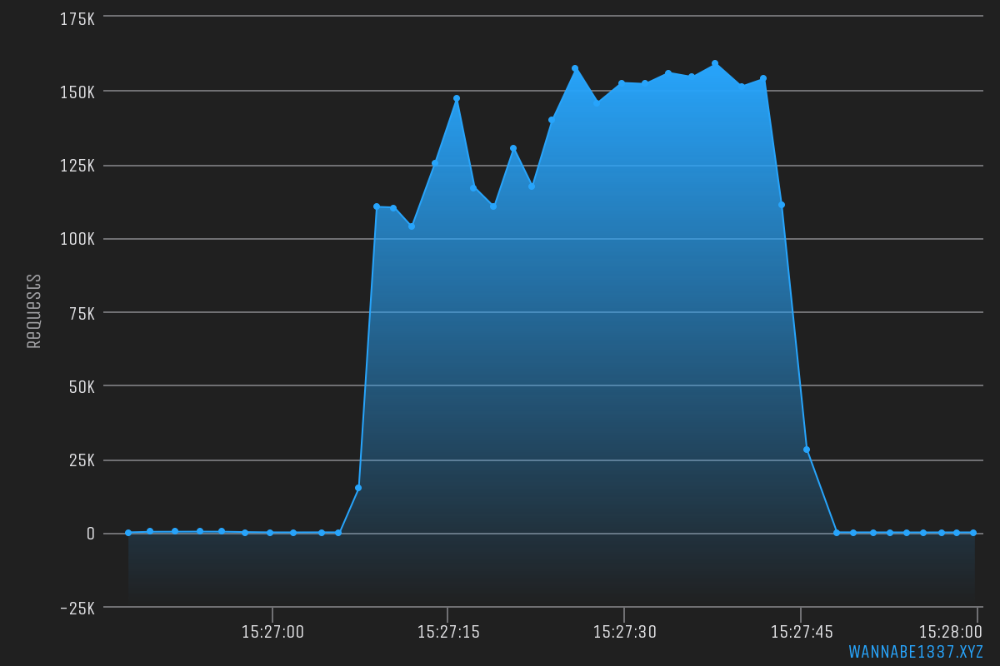

# HTTP_Sockets

[](https://github.com/codemanki/cloudscraper)
[](https://travis-ci.com/Mrakovic-ORG/HTTP_Sockets)

This has been made to achieve high requests per sec and not for bypass since it does not use proxies.



### Install
```sh
git clone https://github.com/Mrakovic-ORG/HTTP_Sockets
cd HTTP_Sockets
npm install
node index.js
```
### Disclaimer
We are not responsible for any damage done with this script, its has been made for educational purpose.

